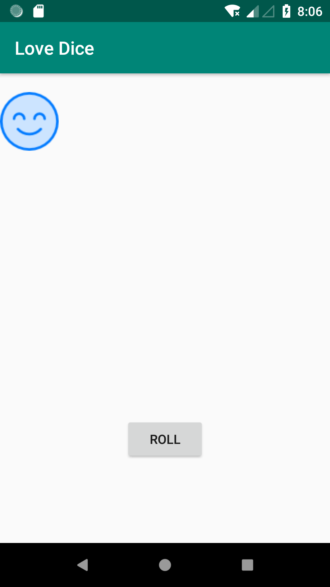
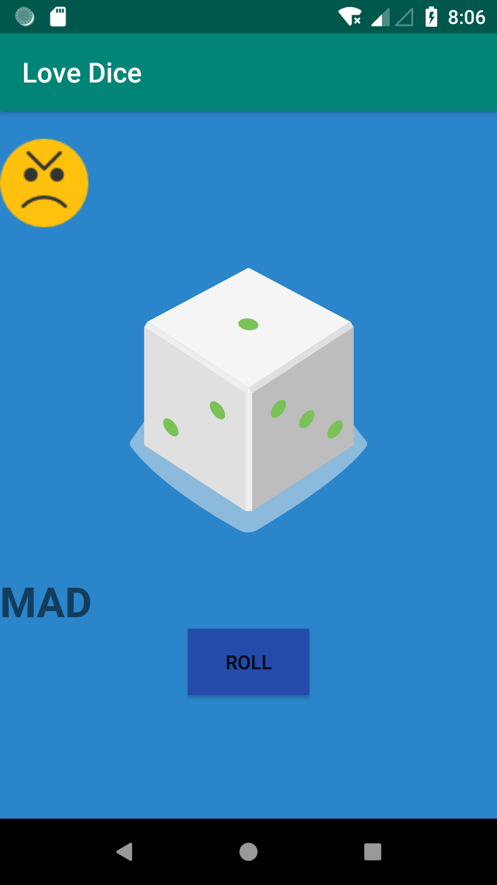
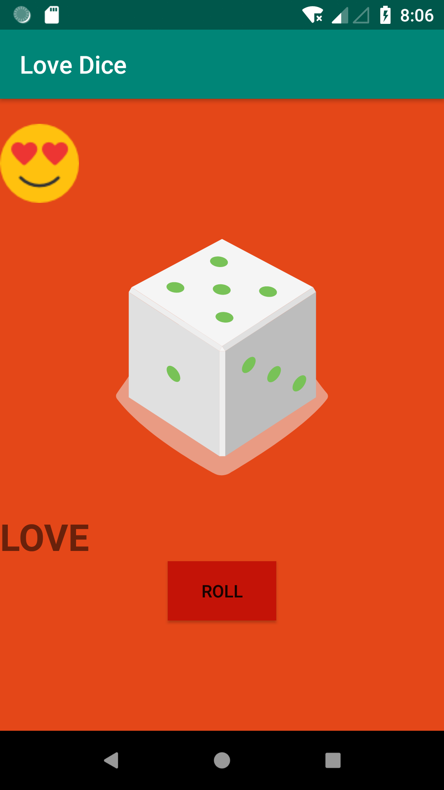

 ```
In-Love ```
--------                                                              


This android application is based on a dice with a probability six at its random values.

`Features:`
--------
*	This application can change its background color into any of its probability color
*	The button used here also changes its color.
*	Implicit as well as the explicit intent properties are established to this application

Snapshot of the application:
-------------------------

  


'Note:'
------
This application since made by me{sandeep dutta}, the name text specified in this application will be as default by the developer.
Link of the application for this above android project : “https://drive.google.com/file/d/1SU2Yj8rQA7lgeE5suYpmiKiH6TbsUAaX/view?usp=sharing”

